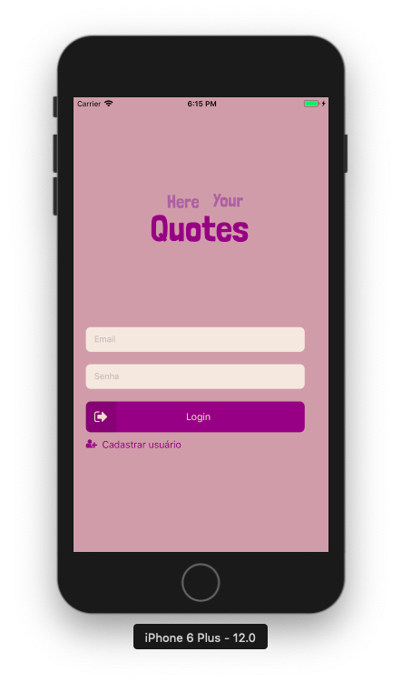
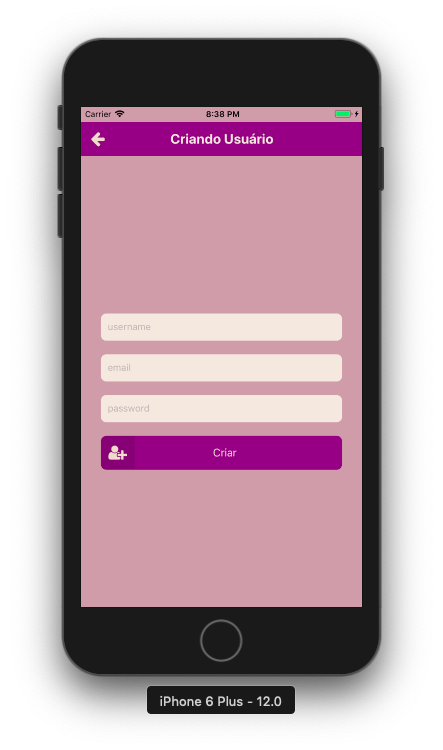
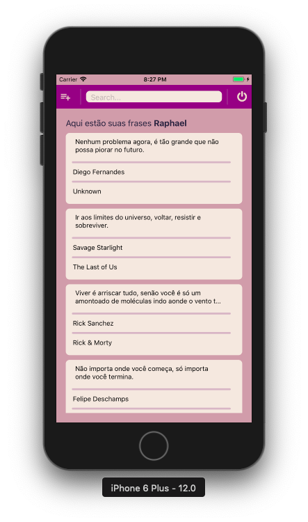
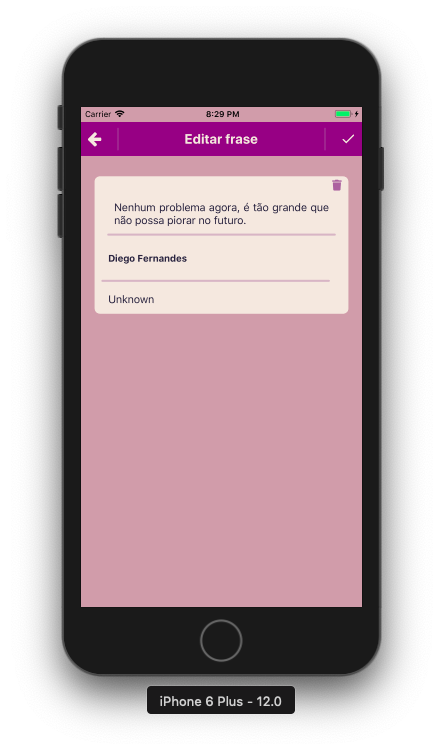
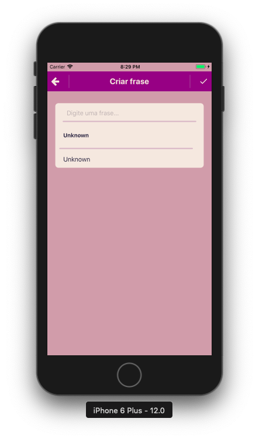

<h1 align="center">
  
</h1>
<h4 align="center">
    
</h4>

# Screenshots

  
  
  

  
  

# About project

> I built this app for appling my knowledg of React-Native in practice, to built something with everything i've studied about RN. It's purpose is pretty simple and base on an habit mine, that I take notes of quotes I've heard somewhere, quotes that inpires me, or teach me something, or I just think is cool. In this app, you can do it, take notes of your quotes, edit them, and see them.

# Features

 - [x] Create User
 - [x] Login
 - [x] Create Quote
 - [x] Edit Quote
 - [x] Delete Quote
 - [x] List Your Quotes
 - [x] Search Specific Quote

# Techs

 - [React-native](https://reactnative.dev/)
 - [Typescript](https://www.typescriptlang.org/)
 - [Styled-Components](https://styled-components.com/)
 - [Axios](https://www.npmjs.com/package/axios)

# Installation & Usage

 - First things first you might have an account on Expo.
 - Second things second clone this repository at your machine by `$ git clone https://github.com/raphaacosta/Here-Your-Quotes-Mobile.git`.
 - Third things Third run `$ npm install` or `$ yarn install` to install all dependencies.
 - Last thing Last, run `$ yarn start` or `$ expo start`, scan the QR code with your Expo app, create your user and then your quotes.

# Contributing

  You are welcome to contribute to this app, all you need to do is follow this steps:
  
  - Fork this project
  - Create a branch with your feature: `git checkout -b my-feature`
  - Commit your changes: `git commit -m 'feat: my new feature'`
  - Push your branch: `git push origin my-feature`.
